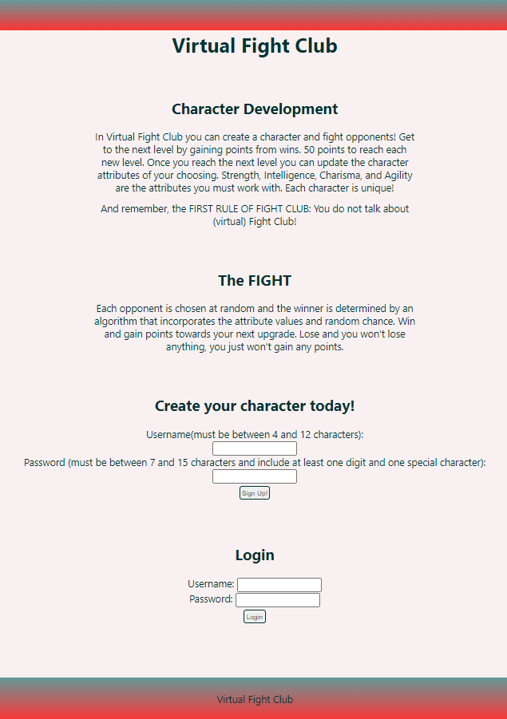
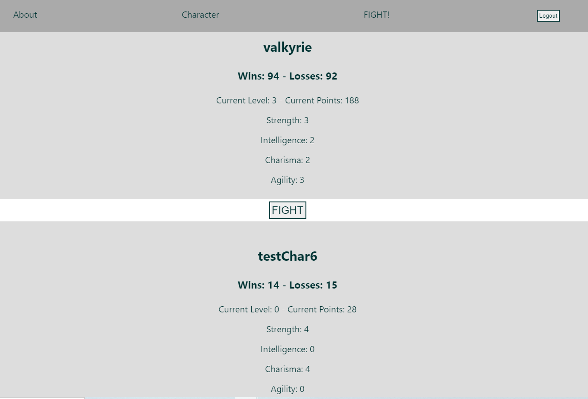
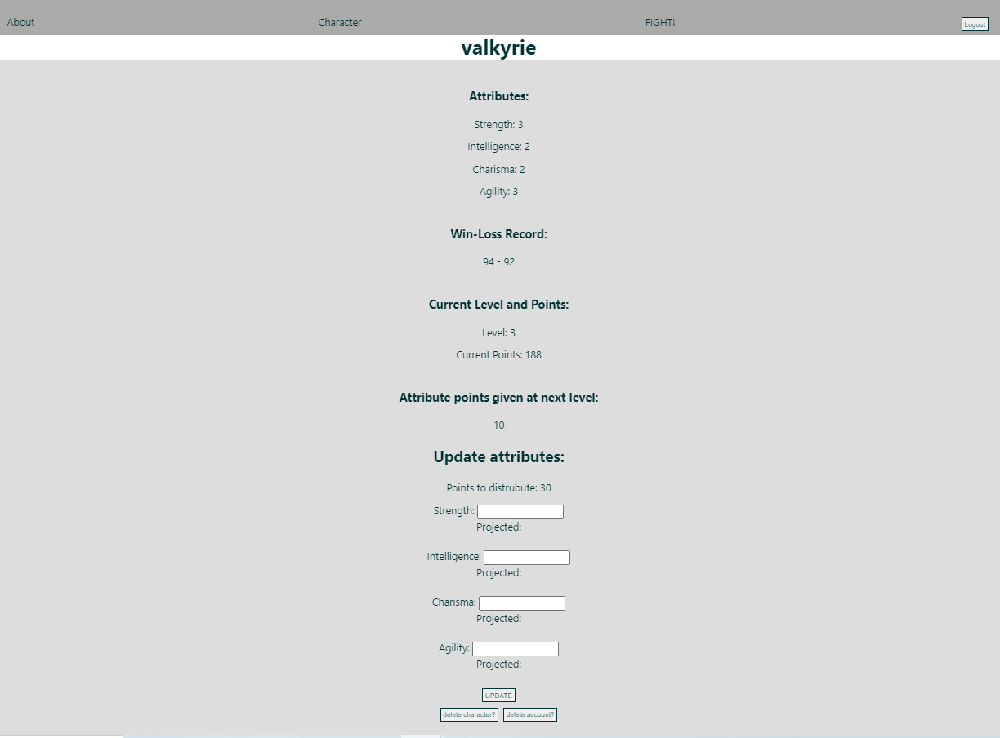
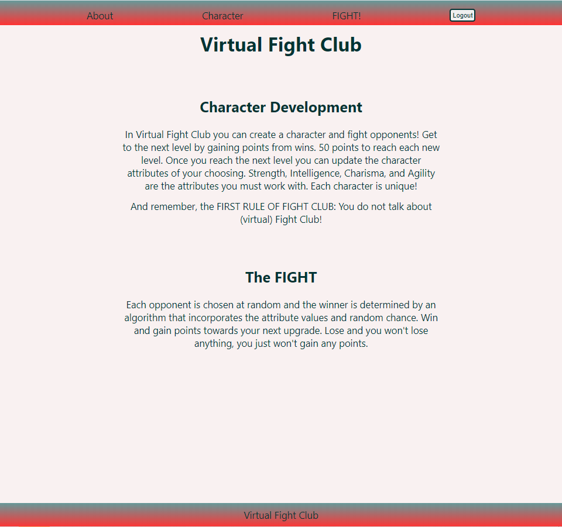

# Virtual Fight Club

Link to live app: https://virtual-fight-club.now.sh/

## Description
In Virtual Fight Club you can create a character to do battle with other users. Characters have four attributes: strength, intelligence, charisma, and agility. Level up by reaching 50 points (2 points per match). Once you reach a new level you can update your character attributes - you are given 10 attribute points at each level. Matches are determined by attribute points and chance. 

## Screenshots
__Landing Page__



__Fight Page__



__Character Page__



__About Page__



## Technology Used
React, HTML, Javascript, CSS, NodeJs, PostgreSQL,

## API documentation/schemas
Please see the endpoints and schemas below:
```
`https://virtual-fight-club.herokuapp.com/api/vfc`
/login
/users
/characters
/matches
/characters/:id
```
### /login 
__POST__: 

request body: 
```
    {
        "username": username, 
        "password": passw
    }
```
returns: 
```
    {
        "login": true,
        "user": [
            {
                "id": 3,
                "auth": "b07162f0-ffaf-11e8-8eb2-f2801f1b9fd1",
                "username": "lydiaMartin",
            }
        ]
    }
```

### /users
__GET__:

query params:
```
    `/users/?login=${login status}&userId=${user_id}`
```
returns:
```
    {
        "users": [{
            "auth": user auth,
            "username": "",
            "passw": "",
        },...  ]
    }
```

__POST__: 

body:  
```
    {
        "auth": user auth,
        "username": "",
        "passw": "",
    }
```
returns: 
```
    {
        "id": user.id,
        "auth": auth,
        "username": username
    }
```

__DELETE__:

body: 
```
    {
        "id": user.id
    }
```
returns:
```
    {
        "user_id": user.id
    }
```

### /characters
__GET__:

returns: 
```
    {
        "characters": [{
            "id": character id,
            "auth": "",
            "username": "",
            "user_id": ,
            "char_name": "",
            "strength": ,
            "intelligence": ,
            "charisma": ,
            "agility": ,
            "current_level": ,
            "current_points": ,
            "wins": ,
            "losses": ,
            "attrpoints": 
        }, ...]
    }
```

__POST__ / __PATCH__:

body: 
```
    {
        "auth": "",
        "username": "",
        "user_id": ,
        "char_name": "",
        "strength": ,
        "intelligence": ,
        "charisma": ,
        "agility": ,
        "current_level": ,
        "current_points": ,
        "wins": ,
        "losses": ,
        "attrpoints": 
    }
```
returns: 
```
    {
        "character": {
            "id": character id
            "auth": "",
            "username": "",
            "user_id": ,
            "char_name": "",
            "strength": ,
            "intelligence": ,
            "charisma": ,
            "agility": ,
            "current_level": ,
            "current_points": ,
            "wins": ,
            "losses": ,
            "attrpoints": 
        }
    }
```

TEST CHARACTER OBJECT:
```
    {
        "auth": "0810bd3e-6112-4c27-a63f-c533e885495c",
        "username": "testcharacter",
        "user_id": 3,
        "char_name": "testy",
        "strength": 5,
        "intelligence": 2,
        "charisma": 2,
        "agility": 1,
        "current_level": 0,
        "current_points": 0,
        "wins": 1,
        "losses": 0,
        "attrpoints": 0
    }
```

__DELETE__:

body:
```
    {
        "id": character id
    }
```
returns:
    success status or error

### /matches
__GET__:

returns: 
```
    {
        "matches":[{
            "char_1_id": current user id,
            "char_2_id": opponent id,
            "winner": ,
            "loser": ,
            "points": 
        },...]
    }
```
__POST__:

body: 
```
    {
        "char_1_id": current user id,
        "char_2_id": opponent id,
        "winner": ,
        "loser": ,
        "points": 
    }
```
returns: 
```
    {
        "match": {
            "id": match id
            "char_1_id": current user id,
            "char_2_id": opponent id,
            "winner": ,
            "loser": ,
            "points": 
        }
    }
```

### /characters/:id
__GET__:

query params: /characters/${user_id}
```
    `/characters/${user_id}`
```
returns:
```
    {
        "character": {
            "id": character id
            "auth": "",
            "username": "",
            "user_id": ,
            "char_name": "",
            "strength": ,
            "intelligence": ,
            "charisma": ,
            "agility": ,
            "current_level": ,
            "current_points": ,
            "wins": ,
            "losses": ,
            "attrpoints": 
        }
    }
```