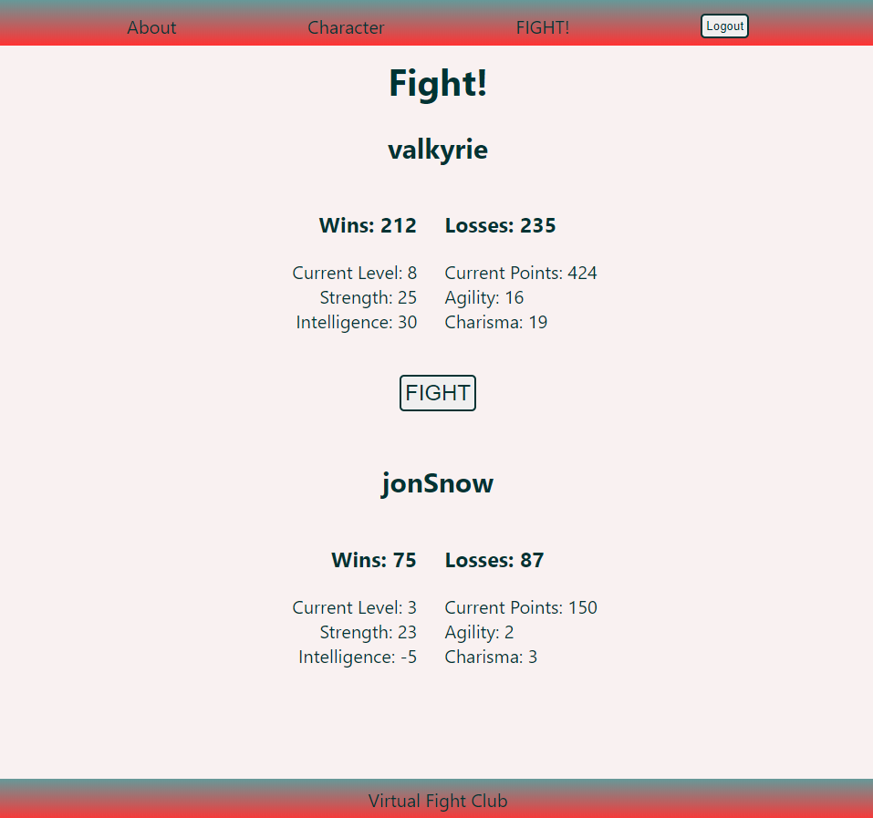
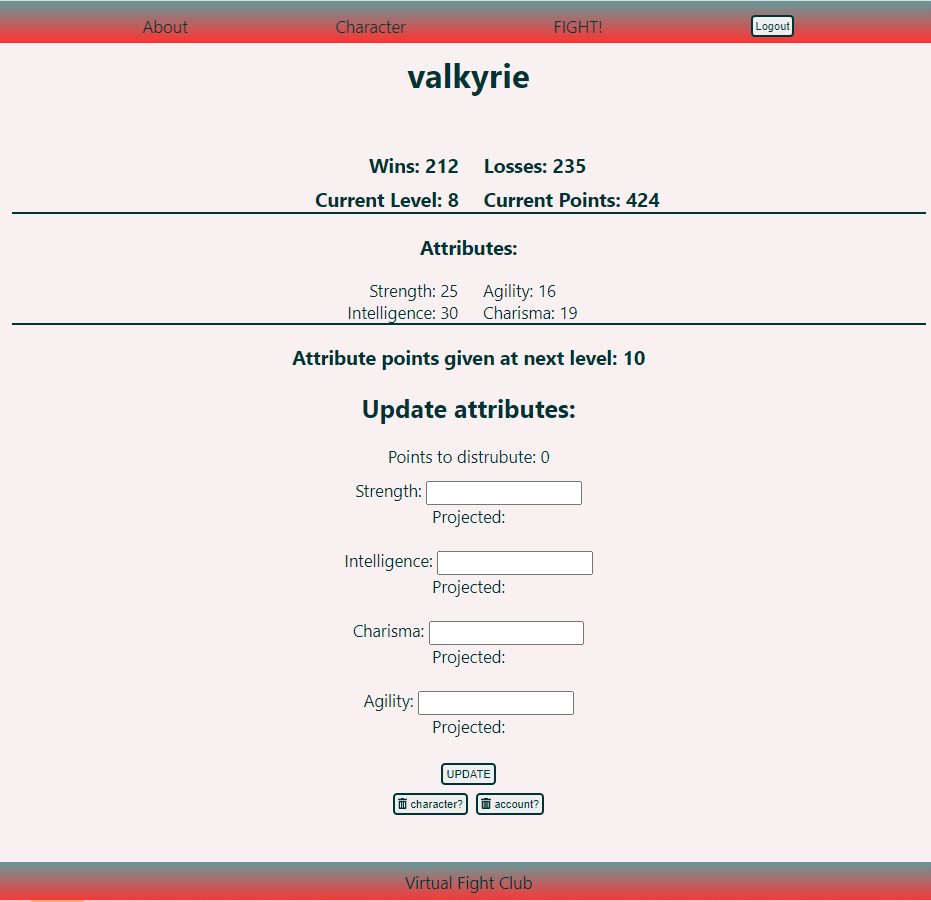

# Virtual Fight Club

Link to live app: https://virtual-fight-club.now.sh/
<!-- documentation for API -->
## Description
In Virtual Fight Club you can create a character to do battle with other users. 

Characters have four attributes: strength, intelligence, charisma, and agility.

Level up by reaching 50 points (2 points per match). Once you reach a new level you can update your character attributes.

Matches are determined by attribute points and chance. 

## Technology Used
React, NodeJs, PostgreSQL